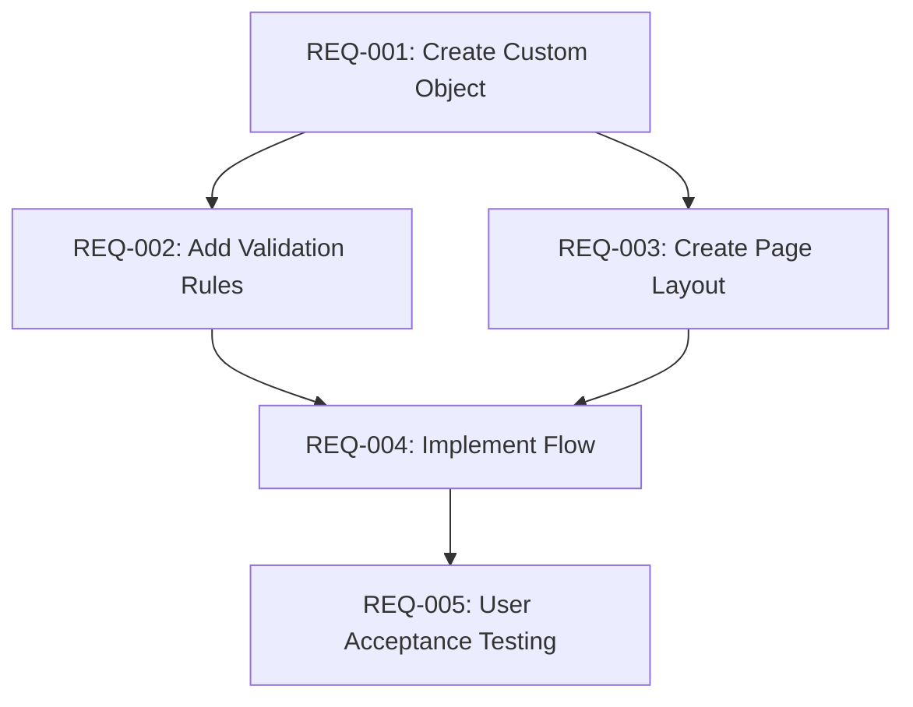

# Technical Dependency Analysis

Framework for identifying and prioritising technical dependencies between user stories.

## Dependency Types

### 1. Data Model Dependencies
**Definition:** Story B requires objects/fields created by Story A

**Examples:**
- Custom object creation before workflows using that object
- Lookup field definition before relationship-based automation
- Record type configuration before page layout assignment

**Identification:**
```
1. Extract all object/field references from user stories
2. Map creation stories vs. usage stories
3. Flag usage stories as dependent on creation stories
```

**Priority Impact:** HIGH - Cannot proceed without data structure

### 2. Integration Dependencies
**Definition:** Story B requires external system connectivity established by Story A

**Examples:**
- Named Credential setup before API callout implementation
- Platform Event definition before subscriber setup
- Middleware configuration before Salesforce integration

**Identification:**
```
1. List all external systems mentioned
2. Identify authentication/connection setup stories
3. Mark integration usage stories as dependent
```

**Priority Impact:** HIGH - Integration testing blocked without connectivity

### 3. Configuration Dependencies
**Definition:** Story B requires configuration elements from Story A

**Examples:**
- Profile/permission set creation before user assignment
- Approval process setup before approval automation
- Sharing rule definition before data access testing

**Identification:**
```
1. Extract configuration elements: profiles, permission sets, rules
2. Map configuration stories to usage stories
3. Create dependency chain
```

**Priority Impact:** MEDIUM - Workarounds possible but inefficient

### 4. Code Dependencies
**Definition:** Story B requires reusable code components from Story A

**Examples:**
- Utility class creation before controller implementation
- Trigger framework setup before trigger logic
- Lightning component library before app development

**Identification:**
```
1. Identify shared code patterns
2. Extract stories creating reusable components
3. Flag stories consuming those components
```

**Priority Impact:** MEDIUM - Can be refactored but impacts velocity

### 5. Security Dependencies
**Definition:** Story B requires security model elements from Story A

**Examples:**
- OWD configuration before sharing rules
- External ID setup before upsert operations
- Field-level security before data entry forms

**Identification:**
```
1. Map security requirements per story
2. Identify foundational security stories
3. Create security dependency tree
```

**Priority Impact:** HIGH - Security gaps create compliance risk

## Dependency Discovery Techniques

### Story Mapping Workshops

**Process:**
1. Map user stories on timeline (backbone + user tasks)
2. Identify technical layers: data, logic, UI, integration
3. Draw dependency arrows between stories
4. Colour-code by dependency type

**Output:** Visual dependency map with story sequencing

### Architecture Reviews

**Checklist:**
- [ ] Review data model for each story
- [ ] Identify shared components
- [ ] Map integration touchpoints
- [ ] Document security requirements
- [ ] Flag governor limit considerations

**Output:** Dependency matrix with risk assessment

### Data Flow Analysis

**Technique:**
1. Create data flow diagram per user story
2. Overlay diagrams to find shared data paths
3. Identify stories that create vs. consume data
4. Sequence by data flow direction

**Output:** Data-driven dependency graph

## Platform Constraint Analysis

### Governor Limits Impact

**SOQL Queries:**
- Limit: 100 per transaction
- Dependency: Stories requiring bulk data processing must consider query optimisation
- Sequencing: Query-heavy features should be staggered to allow performance tuning

**DML Statements:**
- Limit: 150 per transaction
- Dependency: Bulk operations require careful sequencing with trigger design
- Sequencing: Implement trigger framework before multiple object DML stories

**API Calls:**
- Limit: 15,000/day (Enterprise) + 1,000 per user
- Dependency: Integration-heavy stories may require API allocation strategy
- Sequencing: Establish API monitoring before multiple integration stories

**Heap Size:**
- Limit: 6 MB synchronous, 12 MB asynchronous
- Dependency: Large data volume stories require asynchronous processing design
- Sequencing: Implement batch/queueable framework early

### Sharing Rules Impact

**Consideration:**
- Complex sharing calculations impact performance
- Stories adding sharing rules should be sequenced to allow performance testing
- Dependency: Role hierarchy design before sharing rules implementation

**Sequencing:**
1. Org-Wide Defaults configuration
2. Role hierarchy setup
3. Sharing rules implementation
4. Manual sharing features

### Object Relationships

**Master-Detail Constraints:**
- Max 2 master-detail relationships per child object
- Roll-up summary fields only work with master-detail
- Cascade delete implications

**Dependency Sequencing:**
1. Parent object creation
2. Master-detail relationship definition
3. Child object features
4. Roll-up summary implementation

## Dependency Prioritisation Framework

### Risk-Based Prioritisation

**Risk Factors:**
| Factor | Weight | Scoring |
|--------|--------|---------|
| Complexity | 3x | 1-5 scale |
| External dependencies | 3x | Boolean |
| Team unfamiliarity | 2x | 1-5 scale |
| Impact radius | 2x | # affected stories |
| Reversibility | 1x | Boolean (invertible) |

**Formula:**
```
Priority Score = (Complexity × 3) + (External Deps × 3 × 5) + 
                 (Unfamiliarity × 2) + (Impact Radius × 2) + 
                 (Reversibility × 1 × 5)

Higher score = Higher priority (implement earlier)
```

### Reusability Assessment

**Questions:**
- How many stories depend on this component?
- Can the component be generalised for future use?
- Does this component reduce technical debt?

**Prioritisation:**
- High reusability → Earlier implementation
- Single-use → Can be deferred if no blockers

### Blast Radius Analysis

**Definition:** Number of stories impacted if implementation changes

**Calculation:**
1. Count direct dependencies (stories explicitly referencing component)
2. Count indirect dependencies (dependencies of dependencies)
3. Blast Radius = Direct + (Indirect × 0.5)

**Prioritisation:**
- High blast radius → Earlier implementation, more testing
- Low blast radius → Can be implemented later with less risk

## Dependency Visualisation

### Dependency Matrix

```
          REQ-001  REQ-002  REQ-003  REQ-004
REQ-001      -        B        B        -
REQ-002      -        -        B        -
REQ-003      -        -        -        B
REQ-004      -        -        -        -

Legend: B = Blocks, R = Related, C = Conditional
```

### Directed Acyclic Graph (DAG)



### PERT Chart

```
[Start] → [REQ-001: 5d] → [REQ-002: 3d] → [REQ-004: 8d] → [End]
              ↓
          [REQ-003: 4d] --------↗

Critical Path: REQ-001 → REQ-002 → REQ-004 (16 days)
```

### Story Map with Technical Layers

```
Timeline:  Sprint 1         Sprint 2         Sprint 3
         ┌─────────────┬─────────────┬─────────────┐
Data     │ Custom      │ Lookup      │ Roll-up     │
         │ Objects     │ Relationships│ Summaries   │
         ├─────────────┼─────────────┼─────────────┤
Logic    │ Validation  │ Trigger     │ Flows       │
         │ Rules       │ Framework   │             │
         ├─────────────┼─────────────┼─────────────┤
UI       │ Page        │ Lightning   │ Mobile      │
         │ Layouts     │ Components  │ Optimisation│
         ├─────────────┼─────────────┼─────────────┤
Integration│           │ Named Creds│ API Callouts│
         │             │ Setup      │             │
         └─────────────┴─────────────┴─────────────┘

Dependencies flow left-to-right and top-to-bottom
```

## Balancing Technical Dependencies with Business Value

### Conflict Resolution

**Scenario:** High business value story has many dependencies

**Options:**
1. **Defer:** Implement dependencies first (technically correct but delays value)
2. **Mock:** Create temporary implementations to unblock (faster value but technical debt)
3. **Refactor:** Reduce dependencies through architectural changes (balanced but time-consuming)
4. **Parallel:** Split teams to work dependencies concurrently (resource-intensive)

**Decision Framework:**
```
IF (Business Urgency = CRITICAL AND Dependencies = LOW):
    → Implement immediately
ELIF (Business Urgency = HIGH AND Dependencies = MEDIUM):
    → Parallel development if resources available
    → ELSE mock dependencies for MVP
ELIF (Business Urgency = MEDIUM AND Dependencies = HIGH):
    → Implement dependencies first
    → Phase story for later sprint
ELSE:
    → Standard sequencing by dependency chain
```

## Testing Strategy Dependencies

### Sandbox Refresh Cycles

**Consideration:**
- Full Copy Sandbox: Refresh every 29 days
- Partial Copy Sandbox: Refresh every 5 days
- Developer Sandbox: Refresh every 1 day

**Dependency Impact:**
- Integration testing requires refreshed sandboxes with current data
- Stories requiring integrated testing should align with refresh cycles
- Sequence integration stories to minimise sandbox refresh delays

### Test Data Dependencies

**Scenario:** Story B requires test data created by Story A

**Mitigation:**
- Create test data factories as foundational stories
- Use DataLoader scripts for repeatable test data
- Document test data prerequisites per story

**Sequencing:**
1. Test data strategy definition
2. Test data creation automation
3. Feature stories using test data

### Integration Test Environments

**External System Connectivity:**
- Dependency: Named Credentials configured before integration testing
- Sequencing: Environment setup stories before integration feature stories
- Testing: Mock external systems for unit tests, real connections for integration tests

## MVP Scope Reconciliation

### Technique: Dependency Pruning

**Process:**
1. Identify MVP user stories (minimal viable feature set)
2. Extract only dependencies blocking MVP stories
3. Defer non-blocking dependencies to post-MVP

**Example:**
```
MVP: User registration with email verification

Required Dependencies:
✓ User object customisation (email verification fields)
✓ Email template creation
✓ Apex email service class

Deferred Dependencies:
✗ SSO integration (use standard auth for MVP)
✗ Advanced password policies (use defaults)
✗ User profile customisation (use standard profile)
```

### Iterative Delivery

**Phases:**
```
Phase 1: Foundation
- Core data model
- Basic security
- Essential integrations

Phase 2: Core Features
- Primary user workflows
- Standard automation
- Basic reporting

Phase 3: Enhancement
- Advanced features
- Performance optimisation
- Extended integrations
```

**Dependency Mapping:**
- Each phase builds on previous phase dependencies
- No inter-phase circular dependencies allowed
- Phases can be released independently

## Early Warning Indicators

### Incomplete Dependency Analysis

**Symptoms:**
- Frequent blockers discovered mid-sprint
- Stories moved between sprints repeatedly
- Integration failures due to missing prerequisites
- Performance issues from inadequate foundation

**Remediation:**
- Conduct dependency review at sprint start
- Daily standup focus on blockers
- Retrospective analysis of missed dependencies

### Circular Dependencies

**Detection Approach:**
- Map all dependencies in a directed graph
- Use depth-first search to detect cycles
- Any story that references itself through dependency chain indicates circular dependency

**Resolution:**
- Refactor to break circular dependency (introduce intermediate component)
- Reconsider design approach
- Split user story into independent components

## Documentation Template

```markdown
## Technical Dependencies: [User Story ID]

**Story:** [User story description]

### Direct Dependencies (Blockers)

| Dependency ID | Dependency Description | Type | Impact | Status |
|---------------|------------------------|------|--------|--------|
| REQ-001 | Custom object creation | Data Model | HIGH | Complete |
| REQ-005 | API authentication setup | Integration | HIGH | In Progress |

### Indirect Dependencies

| Dependency ID | Via | Impact |
|---------------|-----|--------|
| REQ-002 | REQ-001 | MEDIUM |

### Platform Constraints

- **Governor Limits:** SOQL queries (estimated 15 per transaction)
- **Sharing Model:** Requires OWD configuration complete
- **API Limits:** None

### Sequencing Recommendation

**Can Start:** After REQ-001, REQ-005 complete
**Should Start:** Sprint 3 (based on critical path)
**Risk Level:** MEDIUM (external integration dependency)

### Testing Dependencies

- Test Data: Requires REQ-001 complete (object exists)
- Integration Testing: Requires sandbox with external system connection
- UAT: No additional dependencies
```