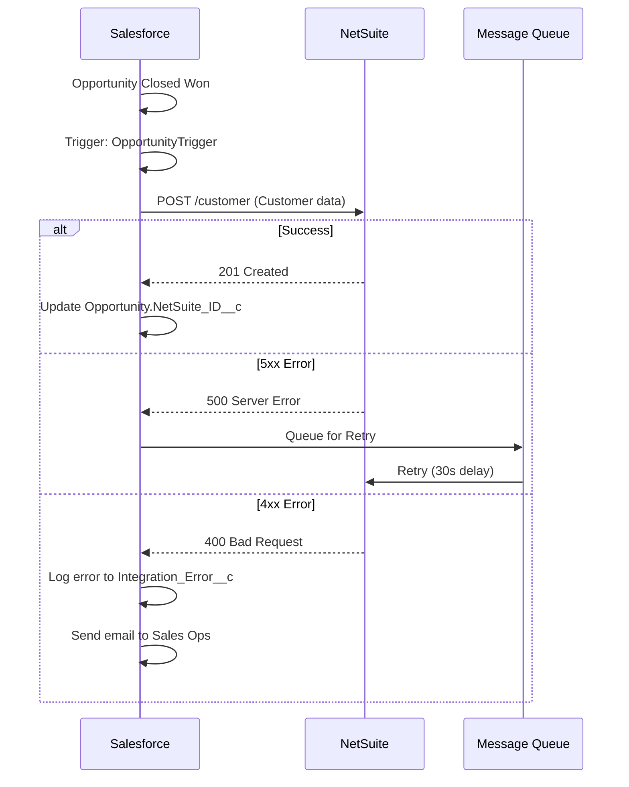

# Integration Patterns and API Strategy

Comprehensive framework for documenting Salesforce integrations in multi-cloud and hybrid environments.

## Standard Integration Patterns

### Pattern 1: REST API
**Use Cases:** Modern web services, mobile apps, microservices

**Characteristics:**
- Synchronous request/response
- JSON/XML payloads
- Standard HTTP methods (GET, POST, PUT, DELETE, PATCH)
- Stateless

**When to Use:**
- Real-time data exchange
- CRUD operations on Salesforce objects
- Integration with modern APIs

**Considerations:**
- API call limits (15,000/24hrs for Enterprise)
- Timeout limits (120 seconds)
- Payload size limits (6MB)

**Documentation Elements:**
```
Endpoint: https://instance.salesforce.com/services/data/v60.0/sobjects/Account
Method: POST
Authentication: OAuth 2.0 Bearer Token
Headers: Content-Type: application/json
Payload: {Account object JSON}
Response: 201 Created with record ID
Error Handling: Retry on 5xx, log on 4xx
```

### Pattern 2: SOAP API
**Use Cases:** Legacy system integration, enterprise service bus

**Characteristics:**
- WSDL-based contract
- XML payloads
- SOAP envelope structure
- Session-based authentication

**When to Use:**
- Integration with legacy systems
- Enterprise-grade error handling
- Complex transaction requirements

**Considerations:**
- More verbose than REST
- WSDL generation required
- Session management overhead

### Pattern 3: Bulk API
**Use Cases:** Large data loads, ETL processes

**Characteristics:**
- Asynchronous processing
- Batch-based (up to 10,000 records per batch)
- CSV, JSON, or XML formats
- Job-based tracking

**When to Use:**
- Loading >2,000 records
- Data migration
- Nightly batch synchronisation

**Considerations:**
- 24-hour processing window per job
- 150 MB max per batch
- Governor limits: 15,000 batches/24hrs

**Documentation Elements:**
```
Job Type: Insert / Update / Upsert / Delete
Object: Account
Batch Size: 10,000 records
Schedule: Nightly at 2 AM UTC
Monitoring: Job status API polling every 5 minutes
Error Handling: Failed records logged to Error_Log__c
```

### Pattern 4: Streaming API (Push Topics)
**Use Cases:** Real-time notifications, event-driven architecture

**Characteristics:**
- Subscribe to SOQL query results
- Bayeux protocol (Comet)
- Near real-time delivery
- Server push to clients

**When to Use:**
- Real-time dashboard updates
- Notification systems
- Event-driven integrations

**Considerations:**
- 24-hour event retention
- Max 100 PushTopic definitions
- Requires connected app setup

### Pattern 5: Platform Events
**Use Cases:** Event-driven integration, decoupled architecture

**Characteristics:**
- Publish/subscribe model
- Custom event definitions
- 72-hour event retention (standard), 3 days (high-volume)
- Guaranteed delivery order

**When to Use:**
- Loosely coupled integrations
- Multi-system event broadcasting
- Asynchronous processing triggers

**Documentation Elements:**
```markdown
### Platform Event: Account_Created__e

**Fields:**
- Account_Id__c (Text)
- Account_Name__c (Text)
- Created_Date__c (DateTime)

**Publishers:**
- Account Trigger
- External API

**Subscribers:**
- Marketing Cloud (via MuleSoft)
- Data Warehouse (via Apex Trigger)
- Analytics Platform (via CometD)

**Delivery Guarantee:** At least once
**Retention:** 72 hours
**Error Handling:** Dead letter queue to Event_Error__c
```

### Pattern 6: Change Data Capture
**Use Cases:** Data synchronisation, audit trail, ETL

**Characteristics:**
- Automatic change notifications
- Standard and custom objects
- Header + change details
- 3-day event retention

**When to Use:**
- Sync Salesforce to external database
- Real-time data replication
- Audit and compliance tracking

**Considerations:**
- Requires API-enabled org
- Governor limit: 250K events/24hrs
- Not suitable for high-frequency changes

## API Strategy Documentation

### Authentication Methods

**OAuth 2.0:**
```
Flow: Web Server Flow / JWT Bearer Flow / Username-Password
Scopes: api, refresh_token, full
Token Lifespan: 15 minutes (access), 90 days (refresh)
Storage: Named Credential
```

**SAML:**
```
Identity Provider: Okta / Azure AD
Assertion Lifespan: 5 minutes
Just-in-Time Provisioning: Enabled
Attribute Mapping: email → Email, name → Name
```

**Named Credentials:**
```
Credential Name: External_API_Creds
URL: https://api.external.com
Authentication Protocol: OAuth 2.0
Scope: read, write
Certificate: Standard
```

### API Versioning Strategy

**Version Control:**
- API version specified in endpoint URL
- Backwards compatibility maintained for 3 releases
- Deprecation notice: 12 months advance

**Example:**
```
Current: /services/data/v60.0/
Previous: /services/data/v59.0/ (supported)
Deprecated: /services/data/v57.0/ (6 months until EOL)
```

**Documentation:**
```markdown
### API Version Strategy

**Current Production Version:** v60.0 (Winter '25)
**Supported Versions:** v58.0, v59.0, v60.0
**Deprecation Policy:** 12-month notice, 3-release support
**Migration Path:** Update API version in Named Credentials quarterly
**Testing:** Sandbox testing 1 month before prod deployment
```

### Rate Limits and Governor Limits

**API Call Limits:**
| Edition | Daily API Calls | Per User |
|---------|-----------------|----------|
| Developer | 15,000 | 1,000 |
| Enterprise | 15,000 + (1,000 × licenses) | 1,000 |
| Unlimited | Unlimited | 1,000 |

**Monitoring:**
```
Real-time: API Usage REST endpoint
Alerts: Email when >80% consumed
Reporting: Daily dashboard of API consumption by integration
```

**Mitigation Strategies:**
- Bulk API for large datasets
- Composite API for multiple operations
- Caching frequently accessed data
- Asynchronous processing for non-critical updates

### Error Handling Patterns

**Retry Logic Strategy:**
- Server errors (5xx): Retry with exponential backoff (3 attempts)
- Authentication errors (401): Refresh token and retry once
- Client errors (4xx): Log and alert, no retry
- Timeouts: Queue for async retry if critical path

**Logging Strategy:**
```
Level | Condition | Storage | Retention
Info | Successful calls (10% sample) | Platform Event | 30 days
Warning | Retries triggered | Custom Object | 90 days
Error | Failed after retries | Custom Object + Email | 1 year
Critical | Service unavailable | Custom Object + PagerDuty | 1 year
```

**Circuit Breaker Pattern:**
```
State Management:
- CLOSED: Normal operation, monitor failures
- OPEN: Service degraded, fail fast without calling
- HALF_OPEN: Testing recovery, allow limited calls

Thresholds:
- 5 consecutive failures → OPEN
- 60 seconds in OPEN → HALF_OPEN
- 2 successful calls → CLOSED

Implementation: Custom metadata for state tracking, platform events for state changes
```

### Performance Benchmarks and SLAs

**Integration SLAs:**
| Integration Type | Target Response Time | Availability |
|------------------|---------------------|--------------|
| Synchronous API | <500ms | 99.9% |
| Batch Integration | <1 hour | 99.5% |
| Real-time Events | <5 seconds | 99.9% |

**Monitoring:**
```markdown
### Integration: CRM to ERP Sync

**SLA:** 99.5% availability, <1 hour latency
**Current Performance:** 99.8% availability, 45 min avg latency
**Monitoring:** MuleSoft Anypoint Monitoring
**Alerting:** Email + PagerDuty when latency >90 min
**Reporting:** Weekly integration health report
```

### Third-Party System Dependencies

**Dependency Catalogue:**
```markdown
### System: Accounting System (NetSuite)

**Integration Type:** REST API
**Data Direction:** Bidirectional
**Frequency:** Real-time (customer creation), Batch (nightly reconciliation)
**Critical Path:** Yes (blocks order processing)
**Fallback:** Queue orders locally, sync when available
**Business Owner:** Finance Director
**Technical Contact:** NetSuite Admin (admin@company.com)
**SLA:** 99.5% availability
**Documented Downtime:** First Sunday of month, 2-4 AM UTC
```

## Integration Architecture Documentation Template

```markdown
## Integration Architecture

### Integration Overview

| System | Type | Direction | Frequency | Protocol | Authentication |
|--------|------|-----------|-----------|----------|----------------|
| ERP | REST | Bidirectional | Real-time | HTTPS | OAuth 2.0 |
| Marketing | Platform Events | Outbound | Event-driven | Bayeux | N/A |
| Data Warehouse | Bulk API | Outbound | Nightly | HTTPS | JWT Bearer |

### Integration: Salesforce → ERP (NetSuite)

**Business Capability:** Order to Cash synchronisation

**Technical Details:**
- **Endpoint:** https://api.netsuite.com/services/customer
- **Method:** POST
- **Authentication:** OAuth 2.0 (Named Credential: NetSuite_OAuth)
- **Frequency:** Real-time (trigger on Opportunity Close)
- **Payload:** JSON (Customer + Order Line Items)
- **Timeout:** 30 seconds
- **Retry:** 3 attempts with exponential backoff

**Data Mapping:**
| Salesforce Field | NetSuite Field | Transformation |
|------------------|----------------|----------------|
| Account.Name | Customer.companyName | Direct |
| Account.BillingStreet | Customer.address.addr1 | Direct |
| Opportunity.Amount | SalesOrder.total | Currency conversion |

**Error Handling:**
- 4xx errors: Log to Integration_Error__c, alert user
- 5xx errors: Retry, queue for batch if exhausted
- Network timeout: Queue for retry in 5 minutes

**Monitoring:**
- Dashboard: Integration_Health_Dashboard
- Alert: Email when error rate >5%
- Reporting: Weekly integration summary to Finance team

**Sequence Diagram:**


**Testing Strategy:**
- Unit Tests: Mock NetSuite responses in Apex tests
- Integration Tests: Sandbox-to-NetSuite Sandbox sync
- Load Tests: 100 concurrent orders
- Failover Tests: NetSuite unavailable simulation

**Change Management:**
- API contract changes: 30-day notice from NetSuite
- Version upgrades: Test in sandbox, deploy during maintenance window
- Rollback: Revert Named Credential to previous version
```

## Multi-Cloud Integration Considerations

**Salesforce Cloud Integrations:**
- Sales Cloud ↔ Service Cloud: Shared objects (Account, Contact, Case)
- Marketing Cloud ↔ Sales Cloud: Marketing Cloud Connect
- Commerce Cloud ↔ Service Cloud: Order → Case integration
- CPQ ↔ Billing: Quote → Invoice flow

**Best Practices:**
- Minimise cross-cloud API calls (use shared objects)
- Leverage native connectors (MC Connect, CPQ-Billing)
- Consider MuleSoft for complex multi-cloud orchestration
- Document data residency and sovereignty requirements